Nama    : Fatriya Ibnu Ash shidiqqi  
Kelas   : TI - 3B  
NIM     : 2241720138  

## Pertemuan 4
### Praktikum 1: Eksperimen Tipe Data List
Selesaikan langkah-langkah praktikum berikut ini menggunakan VS Code atau Code Editor favorit Anda.  
#### Langkah 1:
Ketik atau salin kode program berikut ke dalam void main() 
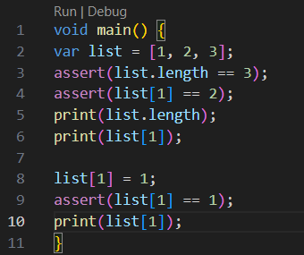
#### Langkah 2:
Silakan coba eksekusi (Run) kode pada langkah 1 tersebut. Apa yang terjadi? Jelaskan!  
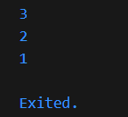
#### Langkah 3:
Ubah kode pada langkah 1 menjadi variabel final yang mempunyai index = 5 dengan default value = null. Isilah nama dan NIM Anda pada elemen index ke-1 dan ke-2. Lalu print dan capture hasilnya.
Apa yang terjadi ? Jika terjadi error, silakan perbaiki.
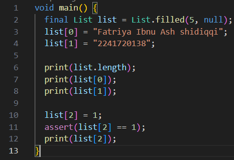  
Hasil  
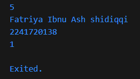  

### Praktikum 2: Eksperimen Tipe Data Set
Selesaikan langkah-langkah praktikum berikut ini menggunakan VS Code atau Code Editor favorit Anda.
#### Langkah 1:
Ketik atau salin kode program berikut ke dalam fungsi main().
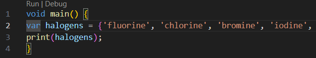
#### Langkah 2:
Silakan coba eksekusi (Run) kode pada langkah 1 tersebut. Apa yang terjadi? Jelaskan! Lalu perbaiki jika terjadi error.
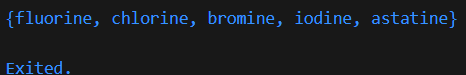
#### Langkah 3:
Tambahkan kode program berikut, lalu coba eksekusi (Run) kode Anda.
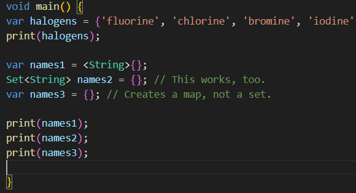
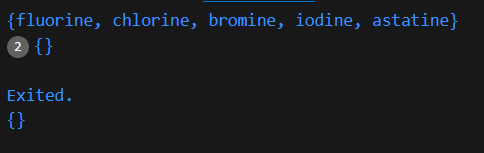

### Praktikum 3: Eksperimen Tipe Data Maps
Selesaikan langkah-langkah praktikum berikut ini menggunakan VS Code atau Code Editor favorit Anda.
### Langkah 1:
Ketik atau salin kode program berikut ke dalam fungsi main().
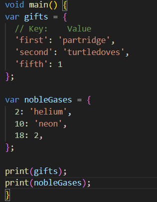  
### Langkah 2:
Silakan coba eksekusi (Run) kode pada langkah 1 tersebut. Apa yang terjadi? Jelaskan! Lalu perbaiki jika terjadi error.
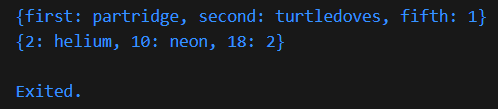
### Langkah 3:
Tambahkan kode program berikut, lalu coba eksekusi (Run) kode Anda.
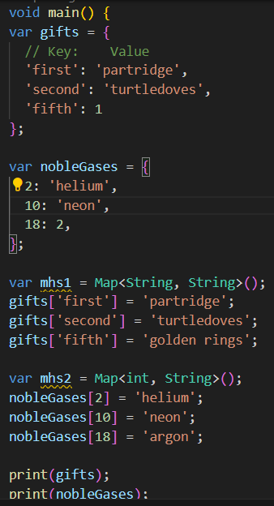  
Apa yang terjadi ? Jika terjadi error, silakan perbaiki.
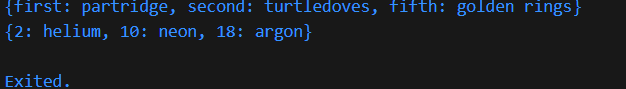  
tidak terjadi error  
Tambahkan elemen nama dan NIM Anda pada tiap variabel di atas (gifts, nobleGases, mhs1, dan mhs2). Dokumentasikan hasilnya dan buat laporannya!
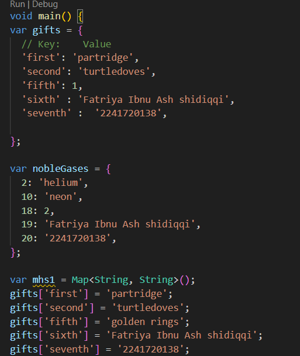
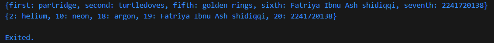